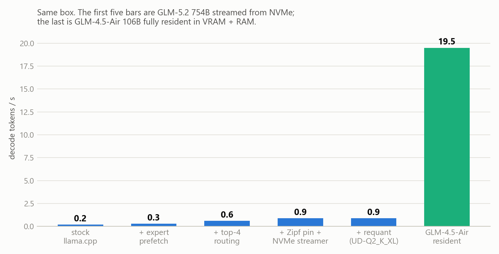
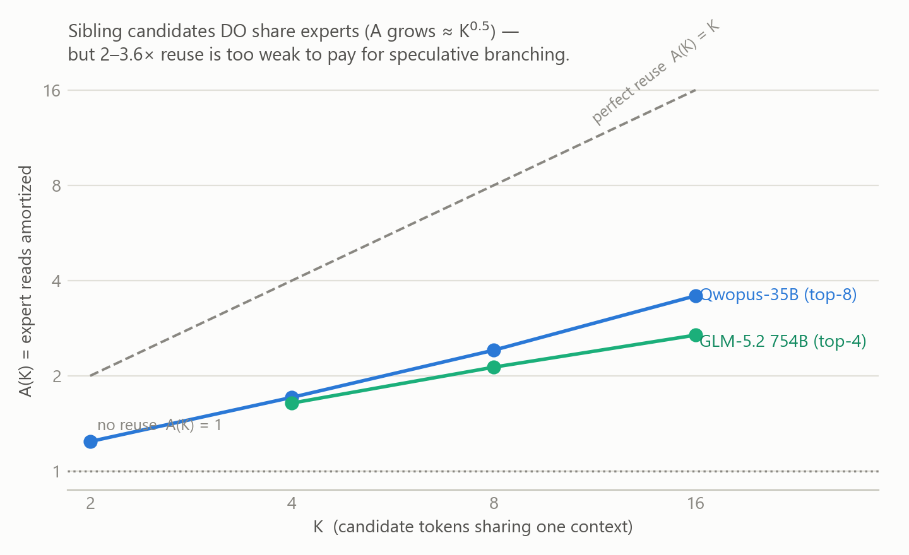
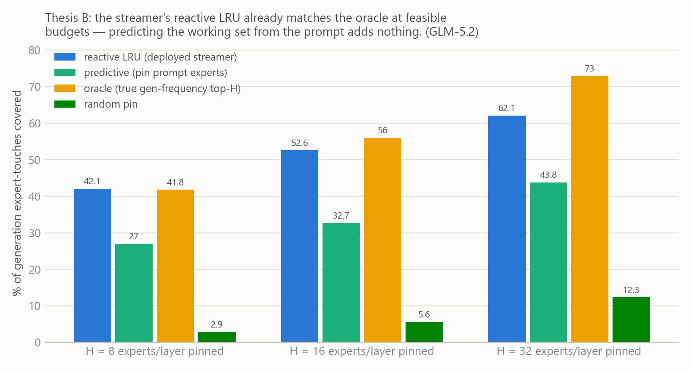
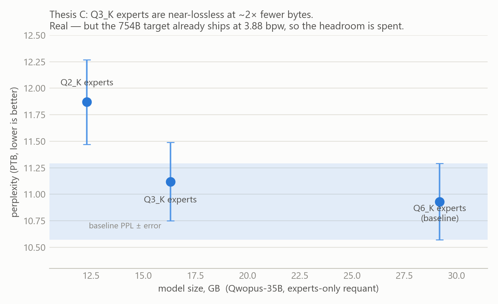
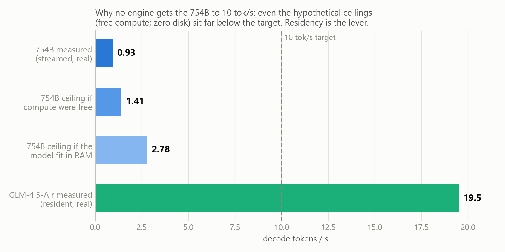

# I spent a week trying to make a 754B MoE fast on one consumer box. Here's the 4.5×, the wall, and the 21× that was hiding behind an honest equation.

**TL;DR:** We took GLM-5.2 (754B MoE, 365 GB) from 0.2 → 0.9 tok/s on a 2-GPU consumer box
by streaming experts from NVMe — then *measured* every remaining idea (speculative trees,
predictive caching, lower-bit experts) to a verdict instead of vibing, and proved 0.9 is the
hardware floor for that model on that box. The same box runs GLM-4.5-Air at **19.5 tok/s**
the moment weights are resident. The negative results are the useful part; the equations
that killed each idea fit on a napkin.

## The box

- RTX 5080 16 GB + RTX 5060 Ti 16 GB (32 GB VRAM total), 31 GB usable RAM
- WD_BLACK SN7100 NVMe: **~5.3 GiB/s** sustained direct reads (NO_BUFFERING, deep queue)
- Target model: GLM-5.2, 754B params, 256 experts/layer, ~92 layers, UD-IQ4_XS = **365 GB**
- That's ~6× the box's combined fast memory. Every decoded token must pull its routed
  expert weights from *somewhere*.

## The one equation that governs everything

```
tokens/sec  ≈  effective_bandwidth / bytes_touched_per_token
```

Everything below is a fight over the two terms. At top-4 routing, one GLM token touches
**~3.4 GB** of expert weights (steady-state cache-miss traffic after a 12 GB RAM cache does
its best). Ceiling from disk alone: 5.7 GB/s ÷ 3.4 GB = **1.55 tok/s**, before a single
matmul runs. Hold that thought.

## Part 1 — Earning 4.5×: 0.2 → 0.9 tok/s



Four changes, each measured before the next was attempted (llama.cpp fork, experts on CPU
path, attention on GPU):

1. **Expert prefetch** (0.2 → 0.3): once the router picks experts, issue their reads
   immediately instead of faulting lazily mid-matmul.
2. **Top-4 routing override** (0.3 → 0.6): the model ships top-8; top-4 halves
   bytes/token for a tolerable quality cost. Bytes are everything, so this is ~2×.
3. **Zipf-guided RAM pinning** (0.6 → 0.9): profiled per-(layer, expert) routing counts.
   Expert usage is *strongly* Zipfian — on GLM, the top **1.7%** of expert slots take
   **25%** of all routings. Pinning the hot set (8 GB budget) is +50%.
4. **Direct-read NVMe streamer** (same 0.9, much more robust): replace page-fault I/O with
   NO_BUFFERING + overlapped deep-queue reads into a reactive LRU. This maxes the
   *bandwidth* term: 3.9 GiB/s sustained bursts during decode.

Also tried and reverted, with numbers: dual-NVMe striping (−22%: the second drive's
random-fault latency poisons the pipeline), fused gate/up/down slab reads (−22%: locality
beats queue depth), MTP/lookahead speculative decoding (net loss — foreshadowing).

## Part 2 — Three theses, three measured verdicts

At 0.9 tok/s, ~64% of each token's wall-clock is pure disk wait; the rest (`t_fix ≈ 0.36 s`)
is CPU expert matmul + per-layer CPU↔GPU sync. We formulated the three remaining idea
families as falsifiable theses and built the cheapest decisive experiment for each.

### Thesis A: amortize I/O across a speculative tree — DEAD, and the reason generalizes

The seductive idea: one token costs 3.4 GB of reads, so evaluate *many* candidate tokens
per read. We instrumented the model to dump per-layer routed-expert sets for K candidate
continuations of the same context, and measured the union:



Sibling candidates genuinely share experts — the union grows ≈ √K, on two very different
models. Reuse is real! But now write down what a speculative tree must actually beat.
Greedy decoding reads **exactly** the experts it uses — greedy is I/O-optimal. A tree
verify that accepts `m` tokens wins only if its extra bytes cost less than the fixed
per-step cost it amortizes:

```
(union_tree − union_greedy(m)) · t_byte  <  (m − 1) · t_fix

tolerance:  R* = 1 + t_fix/t_io = 1 + 0.36/0.71 ≈ 1.51
```

Measured on real trees (2×4, 4×2, 3×3, 2×6): every shape reads **R ≈ 2.8–3.3×** its
accepted path — double the budget — so every shape loses *even at perfect acceptance*
(the required accepted depth exceeds the tree's own depth). No draft model, however good,
can rescue it: the byte budget is blown before acceptance enters the math. This closes
MTP, Medusa-style trees, and lookahead **as a family** for the disk-streamed regime, and
tells you exactly when they come back: when `t_io/t_fix` drops ~2× (i.e., weights mostly
in fast memory — which contradicts the premise).

### Thesis B: predict the working set from the prompt — DEAD

Maybe each *conversation* uses a small predictable expert subset: detect it during prompt
processing, pin it, generate from fast memory. Measured coverage of generation-time expert
touches at a pin budget of H experts/layer:



Two kills: (1) the per-prompt working set is huge and unsaturated — one 96-token GLM
generation touches **38% of all experts** and climbing, so no 31 GB pin can hold it;
(2) the prompt carries real signal (27% ≫ 3% random) but *less* than what a dumb reactive
LRU converges to on its own (42%), and the LRU nearly matches the oracle at feasible
budgets. The streamer you already have is at the caching frontier; prediction adds bytes
it was already going to cache.

### Thesis C: lower-bit experts — REAL, and it still couldn't save this target

The only lever greedy can't already do: shrink `bytes_touched_per_token` itself.



Q3_K experts are near-lossless (+1.7% PPL, inside error bars) at ~2× fewer expert bytes —
on a model that ships at Q6. But the 754B target ships at **3.88 bpw** (Unsloth Dynamic
IQ4_XS); its headroom is ~1.15×. Worse — and this is the finding worth stealing — we
downloaded Unsloth's UD-Q2_K_XL of the 754B (0.70× the file size!) and measured decode:
**0.9 tok/s, unchanged, streaming the same ~3.4 GB/token.** Quality-preserving dynamic
quants protect the *hot* experts, and the hot experts are precisely the bytes streamed
every token. **File size is not the variable; streamed bytes/token is.** A quant that
halves the file without touching hot experts does nothing for tok/s.

Bonus inversion: the folk wisdom "keep hot experts high-precision, crush the cold ones"
is exactly backwards for I/O. Effective streamed bpw = coverage-weighted bpw, dominated
by hot experts. If you want speed, it's the hot experts you must shrink — which is
exactly the quality trade the good quants refuse.

## Part 3 — The two walls (or: why "invent a clever engine" stops working)

Could *any* engine hit 10 tok/s (100 ms/token) with this model on this box?

```
Wall 1 (bus):      3.4 GB/token × 10 tok/s = 34 GB/s sustained from storage
                   — 6× the drive, and above PCIe 4.0 x4 itself.
Wall 2 (compute):  t_fix = 0.36 s/token of CPU expert matmul, thread-saturated
                   at 4 cores  ⇒  even with the model magically ALL in RAM:
                   1 / 0.36 ≈ 2.8 tok/s ceiling.
```



Every byte-cutting lever is measured and spent (quant ~1.15×, sparsity refuted at uniform
0.5 keep-rate, top-k already cut, speculation dead, residency dead) — and they don't
stack; they compete for the same 3.4 GB. And even a perfect I/O engine parks at Wall 2,
because 754B-scale expert matmuls on consumer cores cost what they cost. Breaking Wall 2
means expert matmuls in VRAM ⇒ ~240 GB of VRAM ⇒ a different hardware class. That's not
pessimism; it's two independent inequalities.

## Part 4 — The 21× that was always available

The governing equation says the only remaining move is to change the numerator's *tier*:
get the active weights into silicon that feeds the cores. On this box that means a model
whose weights fit 32 GB VRAM + 31 GB RAM — an Air-class sibling.

GLM-4.5-Air (106B total, ~12B active), UD-Q2_K_XL, 47.4 GB, fully resident (~60% of
experts packed into VRAM by llama.cpp's auto-fit, the rest committed to RAM, zero disk in
the decode loop):

| | GLM-5.2 754B, streamed | GLM-4.5-Air 106B, resident |
|---|---|---|
| decode | 0.90 tok/s | **19.5 tok/s** |
| prompt eval | 1.1 tok/s | 27–29 tok/s |
| cold load | >60 s | ~20 s |

Same GLM family, same box, same day: **21.6×**. Not from a cleverer engine — from
respecting the equation. 3.4 GB/token over a 5.7 GB/s pipe versus ~5 GB of active weights
per token over VRAM/RAM bandwidth. The bytes just live in the right place now.

## What I'd tell you to steal

1. `tok/s ≈ bandwidth / bytes_per_token` — compute both terms for YOUR setup before
   building anything. If required bandwidth exceeds your bus, no scheduler saves you.
2. **Greedy decode is I/O-optimal.** Speculative anything must beat
   `R* = 1 + t_fix/t_io` in byte overhead. In a disk-bound regime it can't.
3. **Model file size ≠ streamed bytes.** Quality-preserving quants shrink the experts you
   rarely read. Measure bytes/token, not gigabytes on disk.
4. A reactive LRU over expert slabs is ~at the caching frontier. Don't build predictors.
5. Expert routing is Zipfian and *breadth*-correlated but *depth*-uncorrelated:
   consecutive tokens churn experts, sibling candidates share them. Any amortization
   scheme lives or dies on this distinction.
6. Measure the cheap decisive experiment before building the engine. Every dead thesis
   above cost hours; the engines they implied would have cost weeks.

*Hardware again for context: 2×16 GB Blackwell GPUs, 31 GB RAM, one fast NVMe. Everything
measured with a llama.cpp fork used as oracle (routing traces via a scheduler eval
callback; direct-read streamer via `GGML_MOE_STREAM`). Happy to share methodology details
in the comments.*
